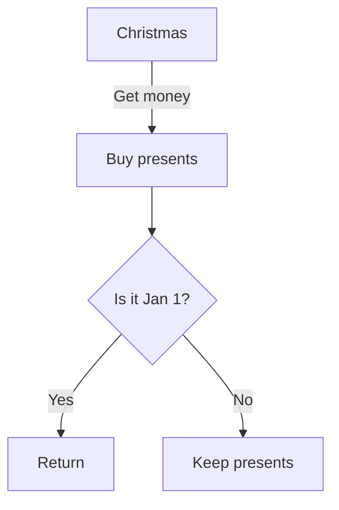

# MCP Diagram Server

A fully MCP-compliant diagram rendering server that exposes tools to render PlantUML, Graphviz (DOT), and Mermaid diagrams to SVG/PNG formats via the Model Context Protocol.

## Features

- 🎨 **PlantUML** - Renders PlantUML scripts to SVG or PNG
- 📊 **Graphviz (DOT)** - Renders DOT source to SVG or PNG
- 🌊 **Mermaid** - Renders Mermaid diagrams to SVG or PNG
- 🔌 **MCP-compliant** - Full MCP protocol support via stdio and SSE
- 🌐 **Multiple modes** - HTTP REST API, MCP stdio, and MCP SSE
- 🚀 **FastAPI** - Built with FastAPI for modern async support

## Project Structure

```
mcp_diagram_server/
├── mcp_diagram_server.py   # Main server (all modes: HTTP, MCP stdio, SSE)
├── mcp_stdio_wrapper.py    # Legacy wrapper (deprecated)
├── diagram_ui.html         # Web UI for interactive rendering
├── README.md                # This file
├── doc/                     # Documentation
│   ├── index.md            # Documentation index
│   ├── usage.md            # Complete usage guide
│   ├── cursor_direct_usage.md  # Cursor integration
│   ├── sse_usage.md        # SSE mode guide
│   ├── web_ui_usage.md     # Web UI guide
│   └── mcp_compliance.md   # MCP protocol details
├── test/                    # Test scripts
│   ├── test_mcp_direct.py  # Test stdio mode
│   ├── test_sse_mode.py    # Test SSE mode
│   └── ...
└── pyproject.toml           # Dependencies
```

## Requirements

### System Dependencies

#### Graphviz
```bash
# macOS
brew install graphviz

# Ubuntu/Debian
sudo apt-get install graphviz

# Windows
# Download and install from https://graphviz.org/download/
```

#### Mermaid CLI (optional, only needed for mermaid rendering)
```bash
# Install globally
npm install -g @mermaid-js/mermaid-cli

# Or use npx (no install needed)
# The server will automatically use npx if available
```

### Python Dependencies

This project uses Poetry for dependency management.

```bash
# Install Poetry if you haven't already
curl -sSL https://install.python-poetry.org | python3 -

# Install Python dependencies
poetry install
```

Or if you prefer pip:
```bash
pip install fastapi uvicorn graphviz requests python-dotenv
```

Note: You still need the Graphviz system binary installed separately.

## Installation

1. **Clone or download this repository**
   ```bash
   cd mcp_diagram_server
   ```

2. **Install Graphviz** (see System Dependencies above)

3. **Install Python dependencies**
   ```bash
   poetry install
   ```

4. **(Optional) Install Mermaid CLI** for Mermaid diagram support
   ```bash
   npm install -g @mermaid-js/mermaid-cli
   ```

## Running the Server

```bash
# Using Make (recommended)
make run

# Using Poetry
poetry run uvicorn mcp_diagram_server:app --host 0.0.0.0 --port 8050 --reload

# Or using uvicorn directly (if dependencies installed via pip)
uvicorn mcp_diagram_server:app --host 0.0.0.0 --port 8050 --reload
```

The server will start on `http://localhost:8050`.

### Using Make

For convenience, a `Makefile` is included with common commands:

```bash
make help       # Show all available commands
make install    # Install dependencies
make run        # Run the server
make test       # Run tests
make test-cov   # Run tests with coverage
make lint       # Lint code
make format     # Format code
make clean      # Clean temporary files
```

## API Endpoints

### POST `/list_tools`

Returns available diagram rendering tools.

**Response:**
```json
{
  "ok": true,
  "tools": [
    {
      "name": "plantuml.render",
      "description": "Render PlantUML diagram text to image",
      "arguments": {
        "text": "string (PlantUML script)",
        "format": "string, 'svg' or 'png' (optional, default 'svg')"
      }
    },
    ...
  ]
}
```

### POST `/call_tool`

Renders a diagram using one of the available tools.

**Request:**
```json
{
  "name": "plantuml.render",
  "arguments": {
    "text": "@startuml\nAlice -> Bob: Hello\n@enduml",
    "format": "svg"
  }
}
```

**Success Response:**
```json
{
  "ok": true,
  "result": {
    "content_type": "image/svg+xml",
    "data_base64": "PHN2Zz4..."
  }
}
```

**Error Response:**
```json
{
  "ok": false,
  "error": "error message"
}
```

## Testing the Server

### Using curl

1. **List available tools:**
   ```bash
   curl -X POST http://localhost:8050/list_tools
   ```

2. **Render a PlantUML diagram:**
   ```bash
   curl -X POST http://localhost:8050/call_tool \
     -H "Content-Type: application/json" \
     -d '{
       "name": "plantuml.render",
       "arguments": {
         "text": "@startuml\nAlice -> Bob: Hello\n@enduml",
         "format": "svg"
       }
     }'
   ```

3. **Render a Graphviz (DOT) diagram:**
   ```bash
   curl -X POST http://localhost:8050/call_tool \
     -H "Content-Type: application/json" \
     -d '{
       "name": "graphviz.render",
       "arguments": {
         "dot": "digraph { A -> B }",
         "format": "svg"
       }
     }'
   ```

4. **Render a Mermaid diagram:**
   ```bash
   curl -X POST http://localhost:8050/call_tool \
     -H "Content-Type: application/json" \
     -d '{
       "name": "mermaid.render",
       "arguments": {
         "text": "graph TD\nA-->B",
         "format": "svg"
       }
     }'
   ```

### Using pytest (Recommended)

Run the comprehensive test suite:

```bash
# Using Make (recommended)
make test           # Run all tests
make test-cov       # Run tests with coverage
make test-verbose   # Run tests with verbose output

# Or using pytest directly
poetry run pytest                    # Run all tests
poetry run pytest -v                 # Run with verbose output
poetry run pytest test_mcp_diagram_server.py::test_plantuml_render_svg -v  # Run specific test
poetry run pytest --cov=mcp_diagram_server --cov-report=html  # Run with coverage report
```

The test suite includes:
- ✅ List tools endpoint
- ✅ PlantUML rendering (SVG & PNG)
- ✅ Graphviz rendering (SVG & PNG)
- ✅ Mermaid rendering (requires mermaid-cli)
- ✅ Error handling (missing arguments, invalid syntax)
- ✅ Edge cases (complex diagrams, default formats)
- ✅ Base64 encoding validity

## Integration with Cursor

### MCP Mode (Recommended)

This is the simplest and most direct way to use the server with Cursor.

**Configure in `~/.cursor/mcp.json`:**

```json
{
  "mcpServers": {
    "mcp-diagram-server": {
      "command": "python3",
      "args": ["/absolute/path/to/mcp_diagram_server.py", "--mcp"],
      "env": {}
    }
  }
}
```

**Replace `/absolute/path/to/`** with the actual path to your server file.

Restart Cursor, and you'll be able to ask the AI to generate diagrams directly!

For detailed instructions, see [cursor_direct_usage.md](doc/cursor_direct_usage.md).

### HTTP Mode (Alternative)

If you prefer to use the server as an HTTP API:

1. **Start the server:**
   ```bash
   make run
   ```

2. **Access the web UI:**
   ```
   http://localhost:8050
   ```

3. **Or use the REST API** programmatically from your code.

## Documentation

For more detailed information, see the [documentation directory](doc/) and the [index](doc/index.md):

- **[usage.md](doc/usage.md)** - Complete usage guide for all modes
- **[cursor_direct_usage.md](doc/cursor_direct_usage.md)** - Cursor IDE integration
- **[web_ui_usage.md](doc/web_ui_usage.md)** - Interactive web UI guide
- **[sse_usage.md](doc/sse_usage.md)** - Server-Sent Events mode
- **[mcp_compliance.md](doc/mcp_compliance.md)** - MCP protocol details

## Troubleshooting

### "graphviz not available"

Ensure Graphviz is installed and accessible:
```bash
which dot  # Should return the path to dot binary
```

On macOS with Homebrew:
```bash
brew install graphviz
```

### "mermaid-cli (mmdc) not found"

Install Mermaid CLI:
```bash
npm install -g @mermaid-js/mermaid-cli
```

Or the server will try to use `npx` if available (slower, but no installation needed).

### Server not starting

Check if port 8050 is already in use:
```bash
lsof -i :8050
```

Use a different port:
```bash
uvicorn mcp_diagram_server:app --port 8081
```

## Example Diagrams

### PlantUML Example

```
@startuml
Alice -> Bob: Authentication Request
Bob --> Alice: Authentication Response
Alice -> Bob: Another authentication Request
Alice <-- Bob: Another authentication Response
@enduml
```

### Graphviz Example


### Mermaid Example



## License

MIT

## Contributing

Contributions welcome! This is a minimal implementation focused on practical diagram rendering for development workflows.
