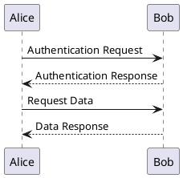
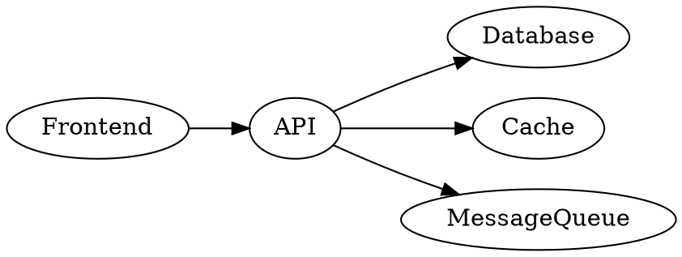
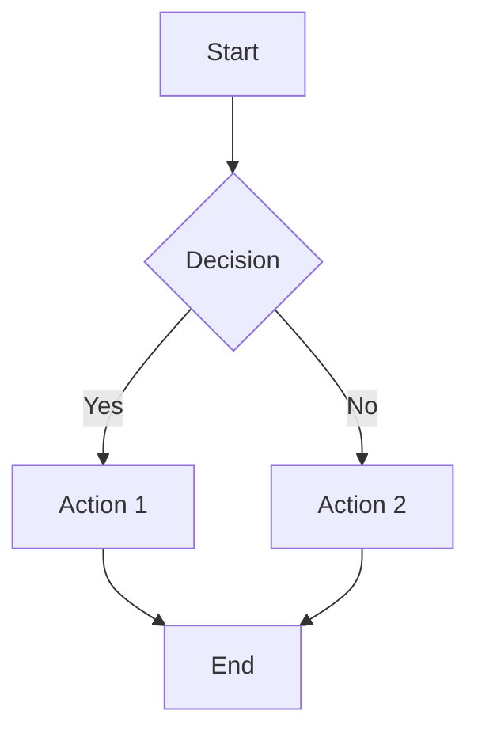

# Web UI Usage Guide

## Overview

The MCP Diagram Server now includes a simple web-based UI for rendering diagrams interactively.

## Accessing the Web UI

1. Start the server:
   ```bash
   uvicorn mcp_diagram_server:app --host 0.0.0.0 --port 8050
   # or
   make run
   ```

2. Open your browser and navigate to:
   ```
   http://localhost:8050
   ```

## Features

The web UI provides:

### 📝 Input Textarea
- Enter your diagram code (PlantUML, Graphviz, or Mermaid)
- Large text area for easy editing
- Syntax highlighting friendly

### 🔽 Diagram Type Selector
- **PlantUML** - Sequence diagrams, class diagrams, etc.
- **Graphviz** - Architecture diagrams, graphs, etc.
- **Mermaid** - Flowcharts, Gantt charts, etc.

### 🎯 Output Format Selector
- **SVG** - Scalable vector graphics (recommended)
- **PNG** - Raster image format

### 🚀 Render Button
- Click to render your diagram
- Shows loading indicator while processing
- Displays the result inline

### 💡 Quick Examples
- Click example buttons to load sample diagrams
- Great for getting started quickly

## Usage Flow

1. **Select Diagram Type** - Choose PlantUML, Graphviz, or Mermaid
2. **Enter Your Code** - Type or paste your diagram code
3. **Choose Format** - Select SVG or PNG
4. **Click Render** - Press the "Render Diagram" button
5. **View Result** - The rendered image appears below

## Example Diagrams

### PlantUML Sequence Diagram


### Graphviz Architecture Diagram


### Mermaid Flowchart


## UI Features

### Modern Design
- Gradient header with purple theme
- Clean, minimalist interface
- Responsive layout
- Smooth animations

### User-Friendly
- Large input area
- Clear labels
- Visual feedback (loading, success, error)
- Example buttons for quick start

### Professional Output
- High-quality SVG rendering
- Sharp images in any size
- Download-ready results

## Error Handling

The UI shows helpful error messages for:
- Missing diagram code
- Invalid syntax
- Network errors
- Server issues

Error messages are displayed in a red alert box with clear descriptions.

## Keyboard Shortcuts

- `Ctrl/Cmd + Enter` - Submit form (if implemented)
- `Ctrl/Cmd + A` - Select all in textarea
- `Ctrl/Cmd + C` - Copy text
- `Ctrl/Cmd + V` - Paste text

## Saving Results

Rendered diagrams can be:
1. **Right-click → Save Image** (for PNG)
2. **Right-click → Inspect → Copy** (for SVG source)
3. **Right-click → Print** (to PDF)

## Tips

1. **Start with examples** - Click the example buttons to see how it works
2. **Use SVG format** - Better quality and smaller file size
3. **Check syntax** - Make sure your diagram code is valid
4. **Experiment** - Try different diagram types to explore capabilities

## Troubleshooting

### Diagram not rendering?
- Check the browser console for errors
- Verify the diagram syntax is correct
- Try the example buttons to test the server

### Server not responding?
- Make sure the server is running: `uvicorn mcp_diagram_server:app --host 0.0.0.0 --port 8050`
- Check the server logs for errors
- Verify dependencies are installed

### Blank output?
- Ensure you entered diagram code
- Check that the diagram type matches the code
- Try a simple example first

## API Integration

The web UI uses the existing `/call_tool` API endpoint, so you can also integrate with other tools or build custom UIs using the same API.

## Development

To customize the UI:
1. Edit `diagram_ui.html`
2. Reload the page in browser
3. Changes are reflected immediately

The UI is a single HTML file with embedded CSS and JavaScript for easy deployment.

